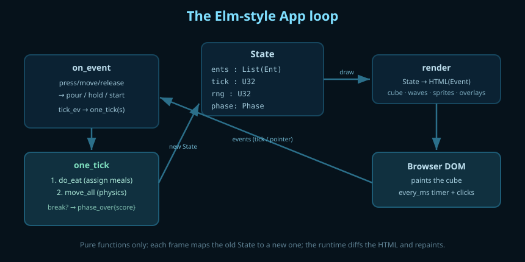
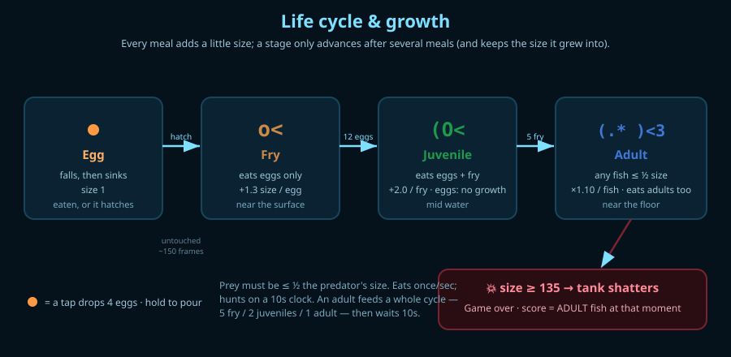
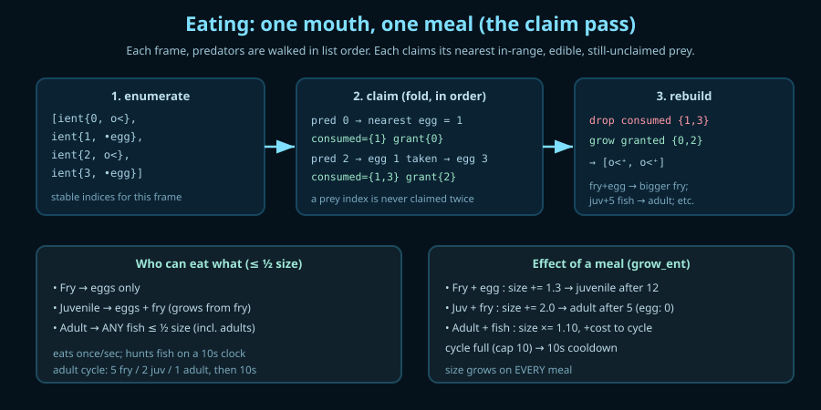
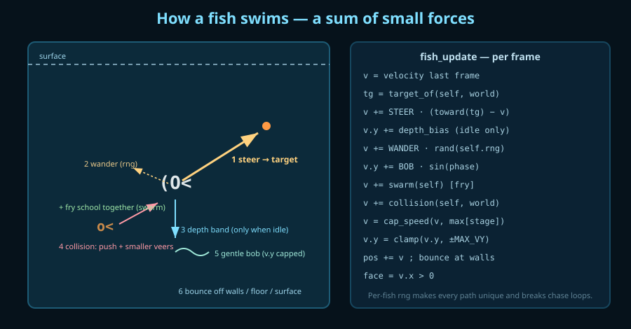
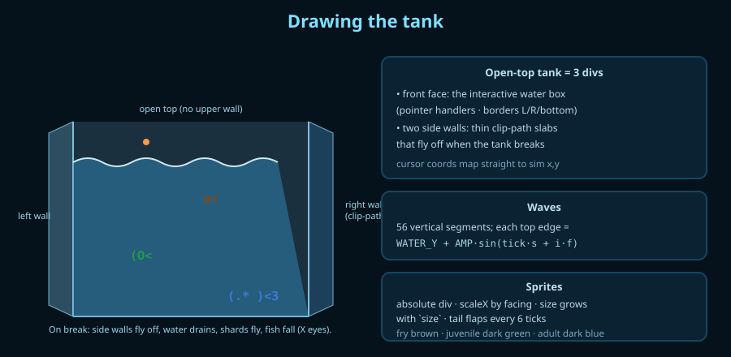

# Aquarium — how it works

A tiny self-contained aquatic ecosystem written in **Bend2** and compiled to a
single HTML file. Drop food into a glass cube of water and watch a food chain
bootstrap itself: eggs hatch into fry, fry grow into juveniles,
juveniles into adults, and adults hunt each other until one grows too big and
shatters the tank.

It is a companion piece to `growing_tree_claude`, but where the tree is a
**discrete cellular grid**, the aquarium lives in **continuous space**: every
creature is a record with floating-point position and velocity, nudged each
frame by a handful of simple steering forces.

- Source: [`main.bend`](./main.bend)
- Built app: [`aquarium.html`](./aquarium.html)

---

## 1. Running it

```sh
# from the repo root — compile the App main to a standalone HTML page
bun run bend/src/CLI.ts demo/aquarium/main.bend -o demo/aquarium/aquarium.html
```

Open `demo/aquarium/aquarium.html` in a browser. **Click — or hold — above the
waterline** to pour eggs and start (eggs only drop from above the surface). Hold
the button down to pour a continuous stream. Your goal is to grow one adult big
enough to shatter the glass; your **score is the number of adult fish** alive at
that moment (with the surviving fry and juveniles noted too).

> App mains compile to `.html`. (A value/IO main would compile to `.js`; passing
> no `-o` type-checks and runs `main` in the reference interpreter.)

---

## 2. Architecture — the Elm-style App loop



The whole program is the standard Bend `App` quadruple:

```
main : App = app{State, Event, init, render, on_event, debug}
```

- **`State`** holds everything: the world (`List(Ent)`), a frame counter
  `tick`, a global `rng` seed, and a `phase` (start / playing / game-over).
- **`render : State → HTML(Event)`** draws the cube, waves, every creature, and
  any overlay. The root element carries `every_ms={FRAME_MS, tick_ev{}}`, which
  asks the runtime to fire a `tick_ev` ~22×/second.
- **`on_event : Event → State → Update`** handles pointer events — `press`
  (start / pour / begin holding), `move` (follow the cursor while held),
  `release` (stop pouring) — and `tick_ev` (advance the simulation; while the
  button is held it also trickles `POUR_N` eggs in at the cursor).

Everything is pure: each frame maps the old `State` to a new one and the runtime
diffs the produced HTML against the DOM.

---

## 3. The world: `Ent` and `Stage`

Eggs and fish share **one** record type so the world is a single flat list we
can `map`/`fold` over uniformly:

```
type Stage { egg{} fry{} juvenile{} adult{} }

type Ent {
  ent{
    stage: Stage,
    x: F32, y: F32,      # center position, in pixels of the front face
    vx: F32, vy: F32,    # velocity, px/frame
    size: F32,           # scale: drives sprite size AND the prey size-cap
    timer: U32,          # eggs: frames sinking (hatch countdown)
                         # fish: frames since its last meal (the 1-second eat cooldown)
    hu: U32,             # fish: frames since its last FISH meal (the 10-second hunt clock)
    fed: U32,            # fry: eggs eaten; juveniles: fish eaten (drives maturing)
    rng: U32,            # per-creature seed, so each one wanders differently
    face: Bool,          # true = facing right (sprite mirrored)
  }
}
```

Because the model is continuous, there is no grid: there are just `Ent`s
floating in a `560 × 380` box, and helper accessors (`e_x`, `e_y`, `e_size`,
`e_stage`, `e_timer`, …) keep the hot loops readable.

---

## 4. The life cycle



| Stage | Sprite | Eats | Grows | Becomes |
|------|--------|------|-------|---------|
| **Egg** | • (orange dot) | — | — | a **fry** if left untouched ~150 frames |
| **Fry** | `o<` (brown) | eggs only | +1.3 size per egg | a **juvenile** after **12** eggs |
| **Juvenile** | `(O<` (dark green) | **eggs + fry** (grows only from fry) | +2.0 per fry (eggs: 0) | an **adult** after eating **5** fry |
| **Adult** | `(.* )<3` (dark blue) | **any fish ≤ ½ its size** (incl. other adults) | ×1.10 size per fish | shatters the tank at size ≥ 135 |

**Who eats whom.** A predator can eat prey only if the prey is **at most half
its size** (`PREY_RATIO = 0.5`) *and* the prey is in its tier (`tier_ok`):
fry eat eggs; **juveniles eat eggs *and* fry — but only fry grow them** (an egg
is just consumed); and **adults eat any fish — fry, juveniles, even other
adults — that is ≤ ½ their size**. Only adults are unrestricted by stage.

**Two clocks pace feeding:**

- Every fish may only **eat once per second** (`EAT_COOLDOWN` on `timer`).
- A juvenile or adult only sets off to **hunt fish on a ~10-second clock**
  (`HUNT_PERIOD` on the separate `hu` clock); between hunts they just cruise.

**The adult feeding cycle.** Once an adult starts feeding it keeps eating (one
bite/second) until it has consumed a full **cycle** — **5 fry, or 2
juveniles, or 1 other adult** (prey are worth `FRY_COST 2 / JUV_COST 5 /
ADULT_COST 10` units, cap `CYCLE_CAP 10`). Only when the cycle fills does its
`hu` clock reset, so it then **waits ~10 s before the next cycle**. (Fry have
no hunt clock — they graze eggs every second; juveniles reset `hu` per fry, so
they take one fry per ~10 s and need 5 to mature.)

**A fish grows a little with *every* meal** — each bite bumps `size`, and the
sprite size is a continuous function of `size`, so a creature visibly swells as
it feeds; a stage only *advances* after its meal count, keeping the grown size.

This makes the chain self-balancing *and* keeps the food web flowing: clicking
makes eggs; uneaten eggs become fry; fry mature into juveniles; juveniles
crop fry; adults crop juveniles and fry. To push one adult to the breaking
size you have to keep the whole pyramid below it fed.

---

## 5. One simulation step (`one_tick`)

When `phase = playing`, each `tick_ev` runs:

```
one_tick:
  1. do_eat(ents)   → assign meals, remove eaten, grow eaters, detect a break
  2. if something broke → phase_over{score}
     else move_all(ents)   → run physics on every creature
```

Eating happens **before** movement, on the same frame snapshot, so all the
"who's next to whom" decisions use one consistent picture of the world.

---

## 6. Eating: one mouth, one meal



Naively, "every fish eats whatever it overlaps" lets two fish both eat the same
egg, or one egg feed a whole crowd. Instead `do_eat` runs a small **assignment
pass** so each piece of prey feeds at most one predator:

1. **`enumerate`** tags every entity with a stable index for this frame.
2. **`claim`** folds over the predators *in list order*. A predator is skipped
   unless it is a fish **off its eat cooldown** (`can_act`: `timer ≥
   EAT_COOLDOWN`). Otherwise it calls `find_prey`, which scans for the
   **nearest** prey that is in biting range, `edible`, and **not already
   claimed**, then records a `consumed` index and a `grant` carrying the prey's
   **stage**. `edible` = `can_eat` (right tier **and** prey ≤ ½ predator size)
   **and**, if the prey is a *fish*, the predator must be in its hunt window
   (`hu ≥ HUNT_PERIOD`); eggs may be eaten any time (so fry and juveniles graze
   eggs subject only to the 1-second cooldown).
3. **`rebuild`** produces the next world: drop everything in `consumed`, and
   apply `grow_ent(e, prey_stage)` to everyone who got a grant.

`grow_ent` always resets the 1-second `timer`, but **size and maturation depend
on what was eaten**: a fry grows from eggs; a **juvenile grows only from fry**
(an egg it eats is just consumed — no size, no progress); an adult grows from any
fish. The **hunt clock `hu`** resets per fry-meal for a juvenile, but for an
**adult only when its feeding cycle fills**: the adult adds the prey's
`stage_cost` to `fed` and, once that reaches `CYCLE_CAP`, zeroes `fed` and `hu`
(starting the ~10 s cooldown); otherwise it keeps `hu` high and feeds again.
`any_broken` then checks `BREAK_SIZE`.

---

## 7. Movement — a sum of small forces



`fish_update` rebuilds a fish's velocity each frame by adding up cheap forces,
clamping to a per-stage max speed, integrating, and bouncing off the walls:

1. **Steer toward the target** (`steer`) — turn velocity a fraction `STEER`
   toward the chosen food/prey at the stage's cruise speed.
2. **Wander** — a small random push derived from the fish's own `rng`. This is
   what keeps a chase from locking into an infinite loop and gives each fish its
   own personality.
3. **Depth band** (`depth_bias`) — a gentle pull toward the stage's preferred
   depth (fry high, juveniles mid, adults low), applied **only when the fish
   has no target** so a fish chasing food still dives/rises freely.
4. **Swarming** (`swarm`, fry only) — within `SWARM_R2` a fry steers toward
   the **centroid** of nearby fry (cohesion) and matches their average
   **heading** (alignment), so fry drift around together as a loose school.
5. **Collision** (`coll_vec`) — fish may overlap a little, but past
   `COLLIDE_FRAC` of their combined radii they repel, weighted by mass so the
   bigger one shoves the smaller; the **smaller fish also veers sideways** to
   pick another path. Predator/prey pairs are **skipped** — that overlap is a
   meal, not a bump (so a hunter swims straight into its prey to eat it).
6. **Bob** — a slow, gentle sine term (vertical motion is also clamped to
   `MAX_VY`, so fish rise and sink calmly rather than darting up and down).
7. **Walls** (`wx`/`wy`) — clamp to the box and flip the relevant velocity
   component. `face` is then set from the sign of `vx`.

### Targeting rules (`target_of`)

- **Fry** → always the nearest **egg** (plus the swarm pull).
- **Juvenile** → grazes the nearest **egg**; in its hunt window it instead
  chases the nearest edible **fry** (eating eggs feeds it nothing, but it still
  clears them).
- **Adult** → in its hunt window it hunts the nearest edible fish (any stage
  ≤ ½ its size, including other adults); otherwise it cruises, drifting toward
  the floor.

`nearest` does a single linear scan; the per-frame cost is `O(n²)` (targeting +
swarm + collision per fish, plus the claim pass).

**No entity cap.** `spawn_eggs_at` — the only way entities are added (tap and
held pour both go through it) — now spawns whenever the source is above the
waterline, with **no upper limit** on the population. Hatching and eating never
raise the count, but pouring does, so a long hold can grow the world without
bound. That keeps the tank as full as you like, at the cost of the `O(n²)`
per-frame work growing with the population — so a very crowded tank can slow
down. (Re-introducing a cap is a one-line guard in `spawn_eggs_at` if needed.)

---

## 8. Physics of falling and sinking (`egg_update`)

An egg behaves differently above and below the surface (and eggs only ever
*enter* above the waterline — `spawn_eggs_at` refuses to drop them in the water):

- **In air** (`y < WATER_Y`): accelerate downward under `AIR_GRAV` up to
  `AIR_MAXFALL`, with a tiny sideways drift — a quick, straight-ish fall.
- **In water**: ease toward a slow terminal `SINK_SPEED`, add a `sin` wobble so
  it drifts as it sinks, and rest on the floor. Meanwhile `timer` counts up; at
  `HATCH_TICKS` the egg **hatches** into a fry in place (size `FRY_BORN` ≈ 3,
  a random facing and a fresh velocity). If a fish eats it first, it never
  hatches.

---

## 9. Rendering the tank



- **The tank** is an **open-topped** box in a `620 × 380` wrapper: a **front
  face** (the interactive water box, with glass borders on the left, right and
  bottom only — no top), and two **side walls** (`cube_left` / `cube_right`)
  drawn as thin slanted parallelograms via CSS `clip-path` for a hint of depth.
  The front face is the pointer target, so cursor coordinates map directly onto
  sim `(x, y)`. Its attributes are built by `face_attrs`, which attaches
  `pointer_down/up/leave` always but **`pointer_move` only while pouring** — the
  runtime re-renders the whole scene on *every* event, so a `pointer_move`
  listener during idle hover would fire a full re-render on each mouse motion and
  visibly lag. Gating it means hovering is free; dragging only re-renders while
  you actually hold the button.
- **Waves** are `N_WAVE = 56` thin vertical segments. Each segment's top edge
  sits at `WATER_Y + drop + WAVE_AMP·sin(tick·WAVE_SPEED + i·WAVE_FREQ)`, plus a
  bright crest highlight. The `drop` term is `0` while playing and grows during
  the break (so the water visibly **drains** away).
- **Sprites** are absolutely-positioned `div`s using `translate(-50%, -50%)` to
  center on `(x, y)`, `font-size` scaled by `size`, and `scaleX(-1)` to mirror
  by facing. The two-frame animation flaps the **tail** every `FRAME_TICKS`
  frames (`o<`↔`o«`, `(O<`↔`(O«`, `(.* )<3`↔`(.* )«3`). Fry are brown,
  juveniles dark green, adults dark blue; eggs are plain orange dots.
- **The tank break** (`phase_over`) is its own animation, driven by
  `over_frame = tick − at`: the two **side walls fly off** (translate + spin +
  fade via `wall_tf`/`wall_opacity`), the water **drains**, ~12 glass **shards**
  tumble outward under gravity, and every fish switches to a dead `X`-eyed glyph
  and **falls to the floor** (`fall_ent` runs instead of the swim update). After
  `OVER_PANEL_DELAY` frames the game-over panel fades in with the adult score and
  a note of the surviving fry/juveniles.

All the dynamic children (waves + sprites + shards + overlays) are concatenated
into one list and spread once (`{...inside}`) — the HTML DSL allows at most one
spread per element.

---

## 10. Randomness, time, and not getting stuck

- **RNG** is a single linear-congruential step, `rng_next`. The global seed
  drives spawns and hatching; every creature also carries its **own** seed so
  the wander force differs per fish. `rand_unit` maps a seed to a float in
  `[-1, 1)`.
- **Time** is just the frame counter `tick` (no real-time clock). Durations are
  expressed in frames: `HATCH_TICKS`, `EAT_COOLDOWN`, `HUNT_PERIOD`, …
- **Anti-stuck**: the per-fish wander, the collision push (the smaller fish
  veers off to pick another path), and re-choosing targets every frame together
  prevent fish from orbiting a target forever or freezing against a wall.

---

## 11. Constants to tune

All near the top of `main.bend`:

| Constant | Meaning |
|----------|---------|
| `WF`, `HF`, `DZ` | front-face size and side-wall thickness |
| `WATER_Y`, `FLOOR` | surface line and sandy floor |
| `FRAME_MS` | frame interval (≈ speed of everything) |
| `HATCH_TICKS` | hatch delay |
| `EAT_COOLDOWN`, `HUNT_PERIOD` | 1-second eat cooldown; 10-second fish-hunt gate |
| `AIR_GRAV`, `AIR_MAXFALL`, `SINK_SPEED` | fall / sink feel |
| `PREY_RATIO` | prey must be ≤ this × predator size (0.5 = half) |
| `FRY_BORN`, `FRY_GROW`, `FRY_MEALS` | fry birth size, per-egg growth, eggs to mature |
| `JUV_GROW`, `JUV_MEALS` | juvenile growth per fry, fry to mature |
| `ADULT_MUL`, `BREAK_SIZE` | adult growth per fish; size that shatters the tank |
| `FRY_COST`, `JUV_COST`, `ADULT_COST`, `CYCLE_CAP` | adult feeding-cycle: prey unit costs + cycle size |
| `STEER`, `DEPTH_K`, `WANDER`, `BOB_AMP/F`, `MAX_VY`, `MARGIN`, `SURF_PAD` | swim feel (`MAX_VY` caps up/down speed) |
| `COLLIDE_FRAC`, `COLL_STR`, `VEER` | collision: overlap limit, push, smaller-fish veer |
| `SWARM_R2`, `COHESION`, `ALIGN` | fry schooling radius² and pull strengths |
| `SPAWN_N`, `POUR_N` | eggs per tap; eggs per held frame (no entity cap) |
| `N_WAVE`, `WAVE_AMP/SPEED/FREQ` | surface look |
| `OVER_GRAV`, `DRAIN_SPEED`, `SHARD_SPEED`, `OVER_PANEL_DELAY` | break animation |
| `COL_EGG`, `COL_BROWN`, `COL_GREEN`, `COL_DBLUE` | sprite colors |

---

## 12. How the behaviour was verified

The reference interpreter is too slow to drive a big sim, and an `App` main
can't be unit-tested through the DOM. So the simulation core was copied into a
**headless harness** that swaps the `App`/`render` half for a `main : String`
test driver, compiled to JavaScript (`-o harness.js`) and run with `bun`. It
exercises the *pure* transition functions directly and asserts the emergent
behaviour over real `one_tick` loops — **34/34 passing**:

```
T1  egg → fry hatch (born size)   PASS
T2  egg falls in air              PASS
T3  egg sinks (stays egg)         PASS
T4  fry → juvenile after meals    PASS
T5  juvenile → adult after meals  PASS
T6  adult grows → break           PASS
T7  fry eats egg                  PASS
T8  shared egg → 1 eater          PASS   (assignment really is exclusive)
T9  break → game over             PASS
T10 eggs hatch over time          PASS
T11 busy world stable             PASS
T12 fry forages (capped)          PASS   (~1 egg/sec under the cooldown)
T13 no-food wander stable         PASS   (no NaN / escaping the box)
T14 juv grows from fry, not egg   PASS
T15 adult grows gradually         PASS   (×1.10/fish, not a huge jump)
T16 needs MORE meals per stage    PASS
T17 ADULT EATS JUVENILE           PASS   (≤ ½ size, hunting + off cooldown)
T18 adult ignores egg             PASS
T19 juvenile eats fry             PASS
T20 tier + half-size sanity       PASS   (adult-eats-adult; juv eats egg, not juv)
T21 score counts adults only      PASS
T22 eat cooldown (1/sec)          PASS   (a just-fed fish can't eat again)
T23 game-over fish fall           PASS   (mid-water fish drop toward the floor)
T24 pour only above water         PASS   (no eggs spawn below the surface)
T25 hunt gate (fish / 10s)        PASS   (off-cooldown adult ignores prey
                                          until its hunt window)
T26 hunt clock reset rules        PASS   (adult keeps hu mid-cycle; juv resets)
T27 fry swarm cohesion            PASS   (a fry is pulled toward its neighbor)
T28 fish collision push           PASS   (overlapping fish shove apart)
T29 NO entity cap (spawn flood)   PASS   (50 taps → 200 entities, no clamp)
T30 NO entity cap (pour 300f)     PASS   (a long hold grows the world unbounded)
T31 juv eats egg, NO growth       PASS   (egg consumed, juvenile size unchanged)
T32 ADULT EATS ADULT              PASS   (a big adult eats a half-size adult)
T33 adult cycle: 5 fry            PASS   (4 keep hu high; the 5th cools it down)
T34 adult cycle: 2 juveniles      PASS   (2 juvenile-meals fill one cycle)
```

T17–T20, T31–T32 cover the predation (any fish ≤ ½ size, adults eat adults,
juveniles eat eggs but only grow from fry); T33–T34 the adult feeding cycle
(5 fry / 2 juveniles / 1 adult per ~10 s); T29–T30 confirm there is no cap.
