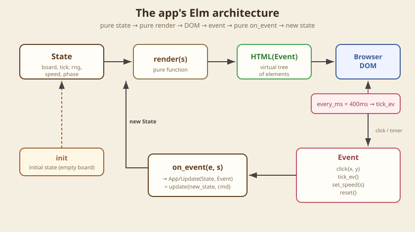
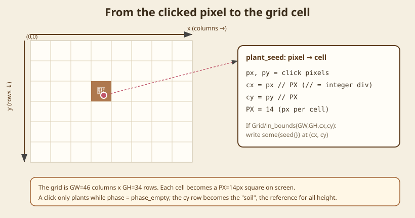
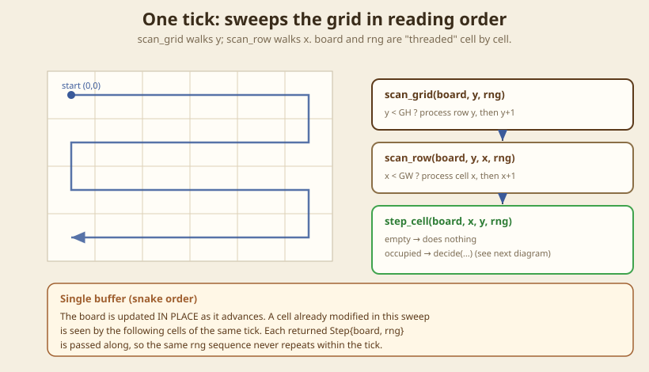
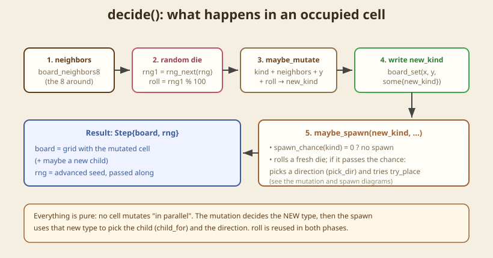
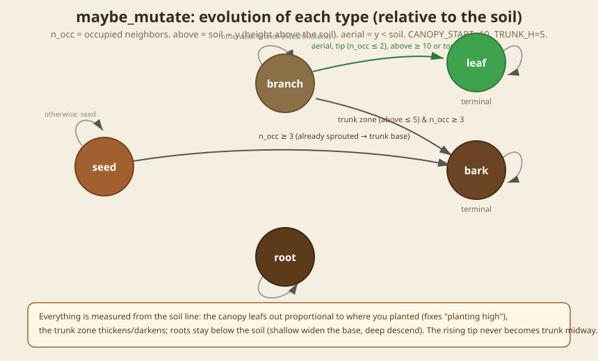
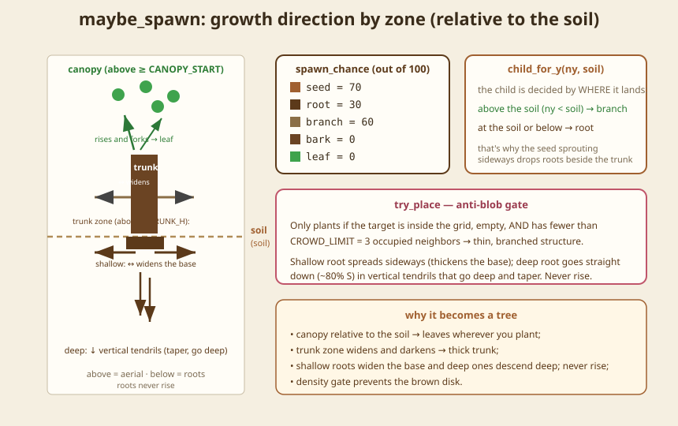
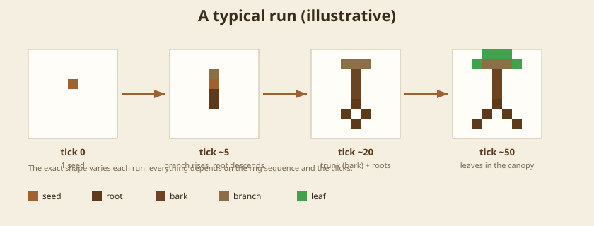

# Growing Tree — exactly how the program works

An illustrated guide to the `main.bend` in this folder: a cellular automaton
that grows a "tree" from a seed planted with a click. Each section points to
the exact function(s) in the code.

> The line references are for `main.bend` at the moment this guide was
> written. The numbers may change; the function names won't.

## Table of contents

1. [30-second overview](#1-30-second-overview)
2. [The architecture: the Elm loop](#2-the-architecture-the-elm-loop)
3. [The types: what the world knows](#3-the-types-what-the-world-knows)
4. [Planting: from pixel to cell](#4-planting-from-pixel-to-cell)
5. [One tick: sweeping the grid](#5-one-tick-sweeping-the-grid)
6. [A cell's decision](#6-a-cells-decision)
7. [Mutation: the state machine](#7-mutation-the-state-machine)
8. [Spawning: growing in space](#8-spawning-growing-in-space)
9. [The side-effect-free RNG](#9-the-side-effect-free-rng)
10. [Render: from grid to pixels](#10-render-from-grid-to-pixels)
11. [Speed and the timer](#11-speed-and-the-timer)
12. [Timeline of a run](#12-timeline-of-a-run)
13. [How to run](#13-how-to-run)

---

## 1. 30-second overview

You click on an empty frame → a **seed** is born, and the click point
becomes the **soil line** (marked by a dotted line). On each *tick*, the
program sweeps the entire grid; every occupied cell can (a) **mutate** into
another type and (b) **spawn** a child into an empty neighbor. Over time the
pattern looks like a tree: roots descending below the soil, a thick trunk
rising, branches and leaves in the canopy. Since everything is measured
relative to the soil line, the tree stays proportional wherever you plant it.

There are five cell types (`type GT`): `seed`, `root`, `bark`, `branch`,
`leaf`. Everything is a pure function — there is no hidden mutable state; the
entire world lives in a single `State` value.

---

## 2. The architecture: the Elm loop



The app is a single value `main : App = app{State, Event, init, render, on_event, debug}`
(last line of the file). The runtime keeps a `State` and a queue of events.
The cycle is always the same:

- **`init`** (`main.bend:366`) produces the initial state: empty grid,
  `tick=0`, `rng=12345`, `speed=normal`, `phase=phase_empty`.
- **`render(s)`** (`main.bend:473`) turns the state into an `HTML(Event)`
  tree — a pure function, never touching the DOM directly.
- The browser applies that tree to the page.
- An **`Event`** arrives (a user click, or the `every_ms` timer).
- **`on_event(e, s)`** (`main.bend:384`) produces a new state inside
  `App/Update`. Back to the top.

No infinite loops or global variables: "time" is just a sequence of `Event`s
applied to successive states.

---

## 3. The types: what the world knows

```bend
type GT { seed{} root{} bark{} branch{} leaf{} }   # cell types
Cell : Type = Maybe(GT)                             # cell = empty or a GT

type State {
  state{ board: Grid(Cell), tick, rng, speed: Speed, phase: Phase, soil: U32, tx: U32 }
}

type Speed { stopped{}  normal{}  fast{}  unlimited{} }   # unlimited = no limit
type Event { click{x,y}  tick_ev{}  set_speed{s}  reset{} }
```

- `Cell` is `Maybe(GT)`: `none{}` = empty ground, `some{k}` = a cell of type `k`.
- `board: Grid(Cell)` is the `GW×GH` grid (**46×34**, with `PX=14` px per cell).
- `phase` distinguishes "nothing planted yet" (`phase_empty`) from "growing"
  (`phase_growing`) — that's what prevents planting a second seed.
- **`soil`** is the line where the seed was planted — the **soil line**.
  All height logic is measured *relative* to `soil`, so the tree stays
  proportional wherever you click. Above `soil` = aerial; below = roots.
  **`tx`** is the planting column — the trunk axis, used by the trunk "push"
  (see §5).
- `Step` is a helper pair `step_st{board, rng}` used to "thread" the grid and
  the RNG through the sweep (see §5).

---

## 4. Planting: from pixel to cell



When you click, the `on_pointer_down={click_event}` attribute
(`main.bend:487`) fires. `click_event` (`main.bend:467`) extracts `x`/`y`
from the `HTML/Pointer` (in the element's local coordinates, of type `I32`),
converts them with `I32/to_u32`, and emits `click{x, y}`.

`on_event` receives that `click`. If `phase = phase_empty`, it calls
`plant_seed`, which converts pixel → cell with integer division:

```bend
cx = px // PX        # PX = 14 px per cell
cy = py // PX
```

If `(cx, cy)` is inside the grid, it writes `some{seed{}}` there, switches
the phase to `phase_growing`, **and stores `soil = cy` and `tx = cx`** (the
soil line and the trunk column). `plant_base` then stamps the **entire base**
at once: a **2-cell** trunk sprout above (`branch` at `cy-1` and `cy-2`) and
**one root on each side** at the soil level (`cx-1` and `cx+1`). This
guarantees a connected base `[root][trunk][root]` and a tree that really
grows upward — without the trunk "floating" above a gap or the seed turning
into a clump of pure roots. From there `render` draws the **dotted soil line**
(`soil_line`) at `cy`. If the phase is already "growing", the click is ignored.

---

## 5. One tick: sweeping the grid



A *tick* (`one_tick`, `main.bend:335`) walks the **entire** grid in reading
order, using nested recursion:

- `scan_grid(board, y, rng)` (`main.bend:326`) — for each row `y` from
  0 to `GH-1`.
- `scan_row(board, y, x, rng)` (`main.bend:318`) — for each column `x`
  from 0 to `GW-1`.
- `step_cell` (`main.bend:311`) — empty cell: does nothing; occupied:
  calls `decide`.

**Crucial detail — single buffer:** the `board` is updated *in place* and the
resulting `Step{board, rng}` is passed to the next cell. That is, a cell
already touched in this tick is seen by the following cells of the **same**
tick (snake order), and the `rng` advances continuously, never repeating the
same sequence within the sweep.

**Trunk push (secondary growth).** Beyond the sweep, every
`TRUNK_PUSH_PERIOD` ticks `one_tick` calls `maybe_push`: in the central band
of columns (`tx ± TRUNK_HALF`), `shift_col_up` shifts the entire aerial part
of that column **one row up** and inserts a compact block of `bark` at the
base. The effect: **trunk chunks** appear that push the tree above them
upward — the trunk thickens and rises over time, making the center denser,
like the secondary growth of a real tree. The growing tip (at the top)
remains a branch and keeps sprouting the canopy while the base accumulates
trunk.

`band_top_clear` is the brake: the push only happens while **row 0** (the top
edge) of the trunk band is empty. When the tree is pushed to the edge of the
screen, the push stops — so the trunk **doesn't grow infinitely** nor throw
cells off the frame.

---

## 6. A cell's decision



`decide(kind, board, x, y, rng, soil)` is the per-cell pipeline (the `soil` is
threaded through the whole sweep for the height rules):

1. **Neighbors** — `board_neighbors8` grabs the 8 surrounding cells.
2. **Die** — `rng1 = rng_next(rng)`, `roll = rng1 % 100` (0–99).
3. **Mutation** — `maybe_mutate(kind, ns, y, soil, roll)` decides the **new type**.
4. **Write** — `board_set(x, y, some{new_kind})`.
5. **Spawn** — `maybe_spawn(new_kind, board, x, y, rng1, soil)` may write a
   child into an empty neighbor.

Returns `Step{board, rng}`. Note that the same `roll` is used in both the
mutation **and** spawn phases.

---

## 7. Mutation: the state machine



`maybe_mutate` is the aesthetic heart. It uses `n_occ` = occupied neighbors
(`count_occupied`) and, **relative to the soil line**, `above = soil - y`
(how far above the soil the cell is) and `aerial = y < soil`. The height
constants are `CANOPY_START = 10` (from how high the tips leaf out) and
`TRUNK_H = 5` (the trunk zone near the soil).

| From     | To       | Condition                                                      |
| -------- | -------- | -------------------------------------------------------------- |
| `seed`   | `bark`   | `n_occ ≥ 3` (already sprouted → trunk base)                    |
| `seed`   | `seed`   | otherwise (still sprouting)                                    |
| `branch` | `leaf`   | aerial, tip (`n_occ ≤ 2`), and `above ≥ 10` **or** at the top (`y ≤ 1`) |
| `branch` | `bark`   | trunk zone (`above ≤ 5`) and `n_occ ≥ 3` (thickens/darkens)    |
| `branch` | `branch` | otherwise (keeps growing/rising)                               |
| `root`   | `root`   | always — roots never surface nor become aerial                |
| `bark`   | `bark`   | terminal                                                       |
| `leaf`   | `leaf`   | terminal                                                       |

The logic in words:

- **Relative height** is what fixes "planting high". Before, the canopy was a
  fixed band of `y`; planting high made the seed already be born "in the
  canopy", so it sprouted little and only sent roots. Now the canopy
  (`above ≥ 10`) and the "at the top of the screen" rule (`y ≤ 1`) guarantee
  a canopy proportional to *where* you planted — no more "just two leaves".
- The **trunk zone** (aerial and `above ≤ 5`) hardens into `bark` when
  well-connected (`n_occ ≥ 3`), and in that band the branches also spread
  sideways (see §8) — that's what makes the **trunk thick and dark**. The
  rising tip is above that band (and has `n_occ ~2`), so it **never** becomes
  trunk midway; it keeps rising.
- **Roots** only grow below the soil and **never** rise nor surface — they
  always stay `root` (thin and dark). Near the base they spread sideways,
  thickening the base; deeper down they descend as tendrils.

Typical result (headless harness, 60 ticks): planting **above the middle**
(soil=14) → ~72 branches, ~28 leaves, ~24 trunk, ~23 roots — balanced.
Planting high (soil=8) → a more compact tree with a thick trunk, but with a
real canopy (~20 leaves). No blob.

Since there is no derived equality for ADTs, type comparison uses `gt_eq`; the
neighbor count comes from `count_occupied`/`count_kind`.

---

## 8. Spawning: growing in space



`maybe_spawn`:

1. `spawn_chance(kind)`: `seed`=70, `root`=30, `branch`=60, `bark`=0,
   `leaf`=0 (out of 100). The chances are deliberately high — what holds back
   the growth is the **density gate** (step 5). Chance 0 → no spawn.
2. Rolls a fresh die; if `roll ≥ chance`, no spawn this tick.
3. `pick_dir(kind, rng, x, y, soil, tx)` — direction in **8 options** (N, NE,
   E, SE, S, SW, W, NW), biased by type **and** position:
   - **branch in the trunk zone** (`above ≤ 5`): spreads sideways too
     (N + E/W + NE/NW) → **thickens the trunk**;
   - **branch in the canopy**: rises and forks (~40% N, NE/NW);
   - **shallow root** (`depth ≤ 2`) **within `ROOT_HALF` columns of the
     trunk (`tx`)**: flares sideways (E/W + SE/SW) → **thickens the base**.
     Beyond `ROOT_HALF`, it **stops widening** and only descends (S) — the
     base never expands horizontally forever;
   - **deep root**: ~80% **straight down** (S) → vertical tendrils that go
     deep and taper;
   - roots **never grow upward**;
   - **seed**: sprouts sideways (E/W → base roots) and a bit N/S (the trunk
     itself was already planted by `plant_base`).
4. `step_dir` computes the neighbor coordinate (including diagonals; clamped
   at 0 by `U32/saturating_sub`).
5. `try_place` — the anti-blob piece: it only writes if the cell is **inside
   the grid**, **empty**, **and** has fewer than `CROWD_LIMIT = 3` occupied
   neighbors. Keeps the structure thin and branched (instead of a disk).
6. `child_for_y(ny, soil)` decides the child **by the position where it
   lands**: above the soil line (`ny < soil`) → `branch` (aerial part); at the
   soil level or below → `root`. That's why the seed sprouting sideways (E/W,
   at the soil level) drops **roots** beside the trunk, connecting root and
   bark. Roots never rise, so they stay contained below the soil.

---

## 9. The side-effect-free RNG

There is no "real" randomness (that would be a side effect). The state carries
`rng: U32` and uses a linear congruential generator:

```bend
def rng_next(s: U32) -> U32:
  (s * 1103515245) + 12345        # main.bend:112
```

Each `rng_next` produces the next deterministic number. Since the `Step`
threads the `rng` cell by cell and tick by tick, the sequence never repeats
within a sweep — but the **same initial seed** always produces the same tree
(useful for reproducing and testing). `init` and `reset` use `rng=12345`.

---

## 10. Render: from grid to pixels

`render` (`main.bend:473`) draws **one `<div>` per occupied cell**,
absolutely positioned:

- `render_cells` (`main.bend:444`) walks the rows; `render_row`
  (`main.bend:432`) walks the columns and emits a `cell_div` only for the
  `some{k}` cells (empty ones are skipped).
- `cell_div` (`main.bend:421`) positions at `left = x*PX`, `top = y*PX`,
  size `PX×PX`, color by `color_of(k)` (`main.bend:408`).
- The toolbar uses `tb_button` with `on_click={ev}` to emit `set_speed` /
  `reset`.
- `legend` + `legend_item` draw the **color legend** (in English: seed, root,
  trunk, branch, leaf), just above the frame, reusing the same `color_of` as
  the cells — so the legend and the drawing never diverge.
- `soil_line(phase, soil)` draws the **dotted soil line** at `top = soil*PX`
  (only when `phase = phase_growing`).

Colors: `seed #a06030`, `root #5c3a1a`, `bark #6b4423`, `branch #8b6f47`,
`leaf #3fa34d`.

---

## 11. Speed and the timer

The root `<div>` has `every_ms={tick_ms(speed), tick_ev{}}`: the runtime emits
`tick_ev` every `tick_ms` ms. When it arrives, `on_event` calls
`run_ticks(steps_per_fire(speed), s)`. Two axes control the speed:

| Speed       | `tick_ms` (interval) | `steps_per_fire` (ticks/fire) |
| ----------- | -------------------- | ----------------------------- |
| `stopped`   | 400                  | 0   (paused)                  |
| `normal`    | 400                  | 1                             |
| `fast`      | 120                  | 6                             |
| `unlimited` | 1                    | 40                            |

**`unlimited`** (the ⏭ Max button) uses the smallest possible interval **and**
a large batch of ticks per fire, so the simulation runs at the machine's
**processing limit**. `run_ticks` runs the N ticks at once (each one includes
the trunk push, see §5). "Pause" (`stopped`) runs 0 ticks.

---

## 12. Timeline of a run



A typical progression: the seed sends a sprout upward (branch) and a root
downward, then hardens at the base (`bark`); the branch rises and forks;
well-packed junctions become trunk (`bark`); the tips that reach the canopy
become leaves. The exact shape varies each run because it depends on the
sequence of `rng` and on where you planted.

---

## 13. How to run

From the repository root:

```sh
bun run bend/src/CLI.ts demo/growing_tree_claude/main.bend -o growing_tree_claude.html
```

Open the generated `growing_tree_claude.html` in the browser. Click wherever
you want to plant — that point becomes the soil line (dotted); what's above it
grows as a tree, what's below it grows as roots. Use the toolbar
(▶ Play / ⏩ Fast / ⏭ Max / ⏸ Pause / ⟲ Reset). **⏭ Max** runs without limit,
at the machine's processing speed.

The constants at the top of `main.bend` are easy to tune: `CANOPY_START`
(canopy height), `TRUNK_H` (trunk zone), `CROWD_LIMIT` (density),
`ROOT_HALF` (maximum width of the root base),
`TRUNK_PUSH_PERIOD`/`TRUNK_HALF` (frequency and width of the trunk chunks),
and the `spawn_chance` chances.

> **Version note:** this app uses the current pointer-event API
> (`on_pointer_down` with an `HTML/Pointer -> Event` handler). The repo's
> `docs/WEBAPPS_GUIDE.md` still documents the old `on_mouse_down`
> (signature `U32 -> U32 -> Ev`), which is **no longer** recognized by the
> compiler.
